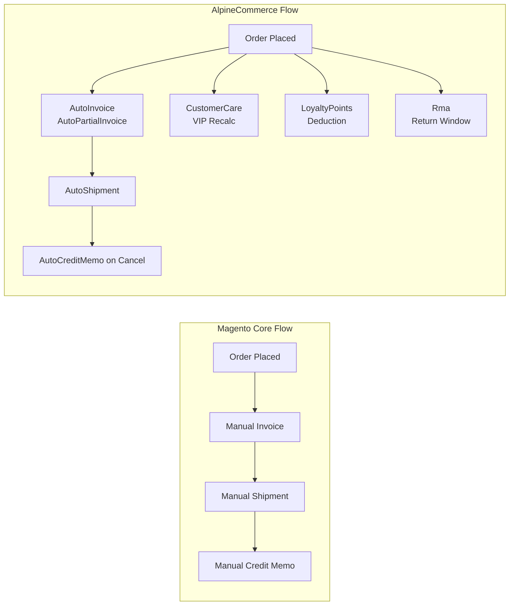
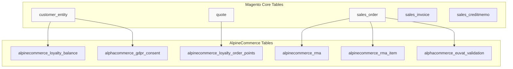
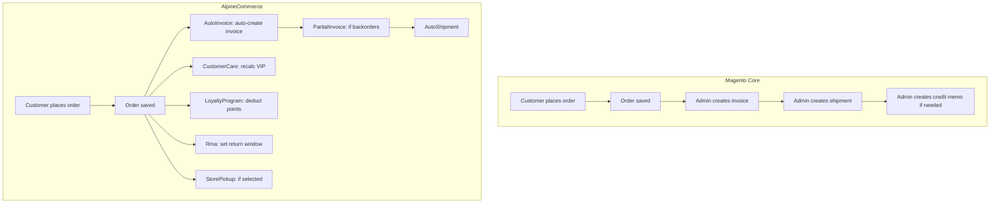
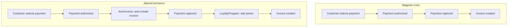
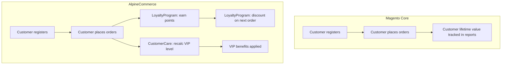

# AlpineCommerce — What We Built, Why, and How

> **Objective**: Explain exactly what AlpineCommerce adds to Magento 2, why each
> custom module exists, which Magento 2 Core concepts it extends, and how it
> changes the standard order/customer/product flows. This is the document to
> read when you want to understand the **delta between Magento Core and the
> actual project**.

---

## Table of Contents

1. [The starting point: Magento 2 Core](#1-the-starting-point-magento-2-core)
2. [What was missing for AlpineCommerce?](#2-what-was-missing-for-alpinecommerce)
3. [The 19 custom modules — why each one exists](#3-the-19-custom-modules--why-each-one-exists)
4. [How we extended Magento — extension points used](#4-how-we-extended-magento--extension-points-used)
5. [Database — custom tables added](#5-database--custom-tables-added)
6. [Flows — Core vs AlpineCommerce](#6-flows--core-vs-alpinecommerce)
7. [What is reused as-is from Core](#7-what-is-reused-as-is-from-core)
8. [Current gaps and next steps](#8-current-gaps-and-next-steps)

---

## 1. The starting point: Magento 2 Core

Magento 2 Core provides a complete e-commerce foundation:

| Area | Magento 2.4.8 provides |
|------|------------------------|
| **Catalog** | Products, categories, attributes, search |
| **Sales** | Quote → Order → Invoice → Shipment → Credit Memo |
| **Customer** | Accounts, addresses, groups |
| **Checkout** | One-page checkout, cart, totals |
| **Payment** | Checkmo, banktransfer, cashondelivery, PayPal, Braintree |
| **Shipping** | Flatrate, freeshipping, tablerates |
| **Admin** | Grids, forms, ACL, system configuration |
| **API** | REST + GraphQL |
| **MSI** | Multi-source inventory |
| **Promotions** | Cart rules, catalog rules |

Magento Core is **generic**. It does not know AlpineCommerce's specific business rules.

---

## 2. What was missing for AlpineCommerce?

AlpineCommerce needed capabilities that Magento Core does not provide out of the box:

| Need | Magento Core | AlpineCommerce solution |
|------|--------------|------------------------|
| Auto-create invoices on order | ❌ Manual only | `AlpineCommerce_AutoInvoice` |
| Partial invoicing for available items | ❌ Manual only | `AlpineCommerce_PartialInvoice` |
| Auto-credit memo on cancellation | ❌ Manual only | `AlpineCommerce_CreditMemo` |
| Customer VIP levels | ❌ None | `AlpineCommerce_CustomerCare` |
| Loyalty points | ❌ None | `AlpineCommerce_LoyaltyProgram` |
| Return window management | ❌ Basic RMA only | `AlpineCommerce_Rma` |
| Store pickup shipping | ❌ None | `AlpineCommerce_StorePickup` |
| EU VAT validation | ❌ None | `AlpineCommerce_EuVat` |
| GDPR consent tracking | ❌ Basic only | `AlpineCommerce_Gdpr` |
| Blog | ❌ None | `AlpineCommerce_Blog` |
| FAQ | ❌ None | `AlpineCommerce_Faq` |
| Product reviews | ❌ Basic only | `AlpineCommerce_ProductReviews` |
| Product questions | ❌ None | `AlpineCommerce_ProductQuestions` |
| Product labels | ❌ None | `AlpineCommerce_ProductLabels` |
| Customer grid enhancements | ⚠️ Basic | `AlpineCommerce_CustomerGrid` |
| SEO hreflang tags | ❌ None | `AlpineCommerce_Hreflang` |
| Store locator | ❌ None | `AlpineCommerce_StoreLocator` |
| Legal pages CMS | ❌ None | `AlpineCommerce_LegalPages` |
| Store initialization | ❌ Manual setup | `AlpineCommerce_StoreSetup` |

---

## 3. The 19 custom modules — why each one exists

### 3.1 Order lifecycle extensions (7 modules)

These modules modify the standard Magento order flow:



#### `AlpineCommerce_AutoInvoice`

**What it does**: Automatically creates invoices when orders are placed.

**Why it exists**: Magento Core requires manual invoice creation. For high-volume stores, this is a bottleneck. AutoInvoice automates it based on payment method filters.

**Extension point**: Observer on `sales_order_place_after`

**Database**: No custom tables. Uses `sales_invoice`.

**Config**: `autoinvoice/general/enabled`, `autoinvoice/general/payment_methods`

---

#### `AlpineCommerce_PartialInvoice`

**What it does**: Automatically creates partial invoices for in-stock items only.

**Why it exists**: When orders contain backordered items, Magento Core does not allow invoicing until stock arrives. PartialInvoice invoices available items immediately, keeping backordered items pending.

**Extension point**: Observer on `checkout_onepage_controller_success_action`

**Database**: No custom tables. Uses `sales_invoice`.

**Config**: `partialinvoice/general/enabled`, `partialinvoice/general/allow_backorders`, `partialinvoice/general/min_qty_to_invoice`

---

#### `AlpineCommerce_CreditMemo`

**What it does**: Automatically creates credit memos when orders are canceled.

**Why it exists**: Magento Core requires manual credit memo creation. CreditMemo automates this and optionally processes refunds automatically.

**Extension point**: Plugin on `Magento\Sales\Model\Order::afterCancel()`

**Database**: No custom tables. Uses `sales_creditmemo`.

**Config**: `autocreditmemo/general/enabled`, `autocreditmemo/general/payment_methods`, `autocreditmemo/general/auto_refund`

---

#### `AlpineCommerce_CustomerCare`

**What it does**: Recalculates customer VIP status after each order.

**Why it exists**: Magento Core has no customer tier/level concept. CustomerCare implements Bronze/Silver/Gold VIP levels based on lifetime spend.

**Extension point**: Plugin on `Magento\Sales\Model\Order::afterPlace()`

**Database**: Adds `vip_level`, `lifetime_spent` columns to `customer_entity`.

**Config**: `customercare/general/vip_enabled`, `customercare/general/vip_thresholds`

---

#### `AlpineCommerce_LoyaltyProgram`

**What it does**: Manages loyalty points — earning on invoice, spending on order, cart discount, minicart display.

**Why it exists**: Magento Core has no loyalty/points system. LoyaltyProgram implements a complete points economy.

**Extension point**: 
- Plugin on `InvoiceRepositoryInterface::afterSave()` — earning
- Plugin on `OrderRepositoryInterface::afterSave()` — spending
- Total collector registered in `etc/sales.xml` — cart discount
- Plugin on `Magento\Checkout\Block\Cart\Sidebar` — minicart

**Database**: 
- `alpinecommerce_loyalty_balance` — point balance per customer
- `alpinecommerce_loyalty_order_points` — points ledger per order
- `quote.alpinecommerce_loyalty_points_used` — points used at checkout

**Config**: `loyaltyprogram/general/enabled`

**REST API**: `POST /V1/carts/mine/loyalty-points` (`setPointsUsed`)

---

#### `AlpineCommerce_Rma`

**What it does**: Complete return merchandise authorization workflow with return window.

**Why it exists**: Magento Core RMA is basic. AlpineCommerce needs automated return windows, approval workflows, and customer-initiated returns.

**Extension point**: Observer on `sales_order_place_after`

**Database**: 
- `alpinecommerce_rma` — RMA requests
- `alpinecommerce_rma_item` — RMA items with qty tracking

**Config**: `rma/general/enabled`, `rma/general/allow_return_days`

**REST API**: Full CRUD for RMA management

---

#### `AlpineCommerce_StorePickup`

**What it does**: Adds store pickup as a shipping method.

**Why it exists**: Magento Core only supports flatrate, freeshipping, and tablerates. StorePickup adds a carrier for in-store pickup.

**Extension point**: 
- Plugins on `Magento\Shipping\Model\Carrier\FlatRate` and `Freeshipping` to filter them when store pickup is selected
- New carrier `AlpineCommerce\StorePickup\Model\Carrier\StorePickup`

**Database**: No custom tables. Uses `sales_order.shipping_method`.

**Config**: `storepickup/general/enabled`, `storepickup/general/stores`

---

### 3.2 Content & Marketing modules (8 modules)

These modules add content and marketing capabilities:

#### `AlpineCommerce_Blog`

**Why**: Magento Core has no blog. Blog adds a complete blog with categories, tags, SEO-friendly URLs, and RSS feeds.

**Extension points**: CRUD with UI Components, admin grid, frontend routes

#### `AlpineCommerce_Faq`

**Why**: Magento Core has no FAQ. Faq adds a question/answer system with categories and search.

**Extension points**: CRUD with UI Components, search integration

#### `AlpineCommerce_ProductReviews`

**Why**: Magento Core reviews are basic. ProductReviews adds ratings, moderation, email notifications, and admin management.

**Extension points**: Plugins on review submission, email notifications

#### `AlpineCommerce_ProductQuestions`

**Why**: Magento Core has no Q&A for products. ProductQuestions lets customers ask questions and receive answers.

**Extension points**: CRUD with UI Components, email notifications

#### `AlpineCommerce_ProductLabels`

**Why**: Magento Core has no product labeling. ProductLabels adds visual labels (New, Sale, etc.) with assignment rules.

**Extension points**: Plugins on product collection, admin grid

#### `AlpineCommerce_LegalPages`

**Why**: Magento Core CMS pages are generic. LegalPages adds specialized pages for Terms, Privacy, Returns with versioning.

**Extension points**: CMS page extensions, admin UI

#### `AlpineCommerce_Hreflang`

**Why**: Magento Core does not generate hreflang tags for multi-store SEO. Hreflang auto-generates `<link rel="alternate">` tags.

**Extension point**: Layout XML injection into `head.additional`

**Database**: No custom tables. Config in `core_config_data`.

---

### 3.3 Infrastructure & Compliance (4 modules)

#### `AlpineCommerce_Gdpr`

**Why**: Magento Core has basic GDPR features but lacks comprehensive consent logging and data export. Gdpr adds consent tracking and data portability.

**Extension points**: Plugins on customer registration, admin export controller

**Database**: `alphacommerce_gdpr_consent` — consent records

#### `AlpineCommerce_EuVat`

**Why**: Magento Core has no EU VAT validation. EuVat integrates with the VIES SOAP service for intra-community VAT validation.

**Extension points**: CLI command, REST API

**Database**: `alphacommerce_euvat_validation` — validation results

#### `AlpineCommerce_CustomerGrid`

**Why**: Magento Core customer grid is basic. CustomerGrid adds columns, filters, and mass actions.

**Extension point**: Plugin on `Magento\Customer\Model\ResourceModel\Customer\Collection` to add joins/filters

#### `AlpineCommerce_StoreSetup`

**Why**: Magento Core requires manual store configuration. StoreSetup automates initial setup with default settings, sample data, and configuration.

**Extension point**: Observer on `admin_init`

---

## 4. How we extended Magento — extension points used

### 4.1 Extension order (least to most intrusive)

```
Plugin        → intercept an existing method
Observer      → react to a business event
Layout XML    → modify the page structure
DI Preference → replace a class (last resort)
New module    → only for new business value
```

### 4.2 What we used and why

| Extension point | Modules using it | Why |
|-----------------|------------------|-----|
| **Observer** | AutoInvoice, PartialInvoice, CreditMemo, Rma, StoreSetup | React to events without modifying core |
| **Plugin (after)** | CustomerCare, LoyaltyProgram, CreditMemo, StorePickup | Modify behavior after original method |
| **Plugin (before)** | StorePickup, StoreSetup | Modify arguments before original method |
| **Plugin (around)** | None | Not needed — before/after sufficient |
| **DI Preference** | None | Avoided — too intrusive |
| **Layout XML** | Hreflang, LoyaltyProgram | Modify page structure without PHP |
| **New Carrier** | StorePickup | Add new shipping method |
| **New Controller** | Blog, Faq, Rma, etc. | Add new admin/frontend pages |
| **New UI Component** | Blog, Faq, LegalPages, etc. | Add new admin grids/forms |
| **Service Contract** | LoyaltyProgram, EuVat, Rma | Expose API via REST |
| **Total Collector** | LoyaltyProgram | Extend cart total calculation |
| **Console Command** | EuVat | Add CLI validation command |

### 4.3 Concrete examples

#### Example 1: AutoInvoice — Observer

```php
// src/app/code/AlpineCommerce/AutoInvoice/Observer/AutoInvoice.php
public function execute(Observer $observer): void
{
    $order = $observer->getEvent()->getOrder();
    
    if (!$order instanceof OrderInterface) {
        return;
    }
    
    // Check conditions: enabled, payment method, canInvoice
    // ...
    
    // Create invoice automatically
    $invoice = $this->invoiceService->prepareInvoice($order);
    $invoice->setCaptureCase(Invoice::CAPTURE_ONLINE);
    $invoice->register();
    $invoice->save();
}
```

**Event**: `sales_order_place_after`
**Source**: `src/app/code/AlpineCommerce/AutoInvoice/etc/events.xml`

---

#### Example 2: CreditMemo — Plugin

```php
// src/app/code/AlpineCommerce/CreditMemo/Plugin/OrderCancelPlugin.php
public function afterCancel(Order $subject, bool $result): bool
{
    if (!$result) {
        return $result;
    }
    
    // Check conditions: enabled, payment method, canCreditmemo
    // ...
    
    // Create credit memo automatically
    $creditmemo = $this->creditmemoService->createByOrder($subject);
    $creditmemo->save();
}
```

**Target**: `Magento\Sales\Model\Order::afterCancel()`
**Type**: `after` plugin
**Source**: `src/app/code/AlpineCommerce/CreditMemo/etc/di.xml`

---

#### Example 3: StorePickup — Plugin (before)

```php
// src/app/code/AlpineCommerce/StorePickup/Plugin/Shipping/FilterFlatRate.php
public function aroundCollectRates(
    \Magento\OfflineShipping\Model\Carrier\FlatRate $subject,
    \Closure $proceed
): ?\Magento\Shipping\Model\Rate\Result {
    // If store pickup is selected, return false (hide flatrate)
    if ($this->isStorePickupSelected()) {
        return false;
    }
    
    return $proceed();
}
```

**Target**: `Magento\Shipping\Model\Carrier\FlatRate::collectRates()`
**Type**: `around` plugin
**Source**: `src/app/code/AlpineCommerce/StorePickup/etc/di.xml`

---

#### Example 4: LoyaltyProgram — Total Collector

```php
// src/app/code/AlpineCommerce/LoyaltyProgram/Model/Total/Quote/LoyaltyDiscount.php
public function collect(
    \Magento\Quote\Model\Quote $quote,
    \Magento\Quote\Api\Data\ShippingAssignmentInterface $shippingAssignment,
    \Magento\Quote\Model\Quote\Address\Total $total
) {
    // Calculate discount based on points used
    $pointsUsed = $quote->getData('alpinecommerce_loyalty_points_used');
    $discount = $this->pointsCalculator->calculateDiscount($pointsUsed);
    
    $total->addTotalAmount('loyalty_discount', -$discount);
    $total->addBaseTotalAmount('loyalty_discount', -$discount);
}
```

**Extension point**: Registered in `etc/sales.xml` as a total collector
**Source**: `src/app/code/AlpineCommerce/LoyaltyProgram/etc/sales.xml`

---

## 5. Database — custom tables added

### 5.1 Complete list

| Table | Module | Purpose |
|-------|--------|---------|
| `alpinecommerce_loyalty_balance` | LoyaltyProgram | Point balance per customer |
| `alpinecommerce_loyalty_order_points` | LoyaltyProgram | Points ledger per order |
| `alpinecommerce_rma` | Rma | RMA requests |
| `alpinecommerce_rma_item` | Rma | RMA items with qty tracking |
| `alphacommerce_euvat_validation` | EuVat | VAT validation results |
| `alphacommerce_gdpr_consent` | Gdpr | GDPR consent records |

### 5.2 Columns added to Core tables

| Table | Column | Module | Purpose |
|-------|--------|--------|---------|
| `customer_entity` | `vip_level` | CustomerCare | VIP level (bronze/silver/gold) |
| `customer_entity` | `lifetime_spent` | CustomerCare | Lifetime spend amount |
| `quote` | `alpinecommerce_loyalty_points_used` | LoyaltyProgram | Points used at checkout |
| `sales_order` | `rma_allowed_until` | Rma | Return window deadline |
| `sales_order` | `rma_enabled` | Rma | Whether RMA is enabled |

### 5.3 Database diagram



---

## 6. Flows — Core vs AlpineCommerce

### 6.1 Order placement flow



### 6.2 Payment flow



### 6.3 Customer lifecycle flow



### 6.4 Return flow

```mermaid
graph TB
    subgraph "Magento Core"
        C1[Customer requests return] --> C2[Admin approves]
        C2 --> C3[Admin creates credit memo]
        C3 --> C4[Refund processed]
    end
    
    subgraph "AlpineCommerce"
        A1[Customer requests return] --> A2[Rma: validate return window]
        A2 --> A3[Rma: create RMA record]
        A3 --> A4[Admin approves]
        A4 --> A5[Rma: mark received]
        A5 --> A6[AutoCreditMemo: auto-create credit memo]
        A6 --> A7[Refund processed]
    end
```



---

## 7. What is reused as-is from Core

AlpineCommerce does NOT reimplement everything. The following are used **as-is** from Magento 2 Core:

| Area | Core component | AlpineCommerce usage |
|------|---------------|----------------------|
| **Order management** | `Magento_Sales` | Used directly, no modifications |
| **Quote management** | `Magento_Quote` | Used directly, no modifications |
| **Customer management** | `Magento_Customer` | Extended with VIP columns |
| **Checkout** | `Magento_Checkout` | Used directly, loyalty discount via total collector |
| **Payment** | `Magento_Payment` | Used directly, AutoInvoice triggers capture |
| **Shipping** | `Magento_Shipping` | Extended with StorePickup carrier |
| **Inventory** | `Magento_Inventory` (MSI) | Used directly |
| **Catalog** | `Magento_Catalog` | Used directly for product modules |
| **Admin grids** | `Magento_Ui` | UI Components reused for all admin pages |
| **REST API** | `Magento_Webapi` | Service contracts exposed via webapi.xml |
| **GraphQL** | `Magento_GraphQl` | Available but not heavily used yet |

**Key principle**: We extend, we don't replace. Every Magento Core feature is preserved and used as the foundation.

---

## 8. Current gaps and next steps

### 8.1 What works today

✅ Order auto-invoicing (full and partial)
✅ Auto-credit memo on cancellation
✅ Customer VIP management
✅ Loyalty points (earning, spending, cart discount)
✅ RMA with return windows
✅ Store pickup shipping
✅ Blog, FAQ, Reviews, Questions, Labels
✅ GDPR consent tracking
✅ EU VAT validation
✅ Customer grid enhancements
✅ Store setup automation
✅ SEO hreflang tags
✅ Legal pages CMS
✅ Complete documentation (50+ files, 15,000+ lines)

### 8.2 What needs work

| Priority | Gap | Module | Next step |
|----------|-----|--------|-----------|
| **High** | LoyaltyProgram admin UI | LoyaltyProgram | Complete admin interface for points management |
| **High** | EuVat admin UI | EuVat | Complete admin interface for validation history |
| **High** | Hreflang SEO validation | Hreflang | Test with Google Search Console |
| **Medium** | Automated tests | All | Add unit/integration tests |
| **Medium** | CI/CD pipeline | All | GitHub Actions for testing |
| **Medium** | Performance | All | Redis, Varnish, flat tables |
| **Low** | Mobile app | All | React Native or Flutter |
| **Low** | Microservices | All | Split into microservices |

### 8.3 Documentation gaps

| Priority | Gap | Solution |
|----------|-----|----------|
| **High** | Module docs for Gdpr, StorePickup, StoreLocator | Finalize existing docs |
| **Medium** | Prerequisite guides | Add missing Magento-specific guides |
| **Low** | Video tutorials | Create video walkthroughs |

---

## Quick reference

### By extension point

| Extension point | Count | Modules |
|-----------------|-------|---------|
| Observer | 7 | AutoInvoice, PartialInvoice, CreditMemo, Rma, StoreSetup, CustomerCare, Gdpr |
| Plugin (after) | 8 | CustomerCare, LoyaltyProgram, CreditMemo, StorePickup, ProductReviews, ProductQuestions, ProductLabels, Hreflang |
| Plugin (before) | 3 | StorePickup, StoreSetup, CustomerGrid |
| Total Collector | 1 | LoyaltyProgram |
| New Carrier | 1 | StorePickup |
| New UI Component | 8 | Blog, Faq, LegalPages, ProductReviews, ProductQuestions, ProductLabels, CustomerGrid, Gdpr |
| Service Contract | 5 | LoyaltyProgram, EuVat, Rma, CreditMemo, PartialInvoice |
| Console Command | 1 | EuVat |
| Layout XML | 2 | Hreflang, LoyaltyProgram |

### By database impact

| Impact | Count | Modules |
|--------|-------|---------|
| Custom tables | 6 | LoyaltyProgram, Rma, EuVat, Gdpr |
| Core table extensions | 5 | CustomerCare, LoyaltyProgram, Rma, StorePickup |
| No DB changes | 8 | Blog, Faq, LegalPages, ProductReviews, ProductQuestions, ProductLabels, Hreflang, StoreSetup |

### By business domain

| Domain | Modules | Count |
|--------|---------|-------|
| **Order management** | AutoInvoice, PartialInvoice, CreditMemo, Rma | 4 |
| **Customer management** | CustomerCare, LoyaltyProgram, CustomerGrid | 3 |
| **Content** | Blog, Faq, LegalPages, ProductLabels | 4 |
| **Marketing** | ProductReviews, ProductQuestions, Hreflang | 3 |
| **Compliance** | Gdpr, EuVat | 2 |
| **Shipping** | StorePickup, StoreLocator | 2 |
| **Infrastructure** | StoreSetup, HealthCheck, Test | 3 |

---

*Last updated: 2026-09-07*
*This document explains the "why" behind every AlpineCommerce custom module and how it extends Magento 2 Core.*
