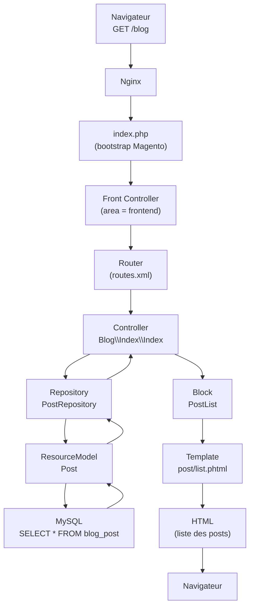
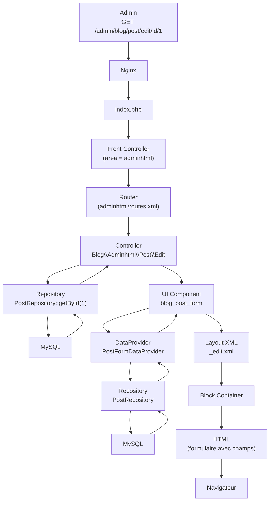
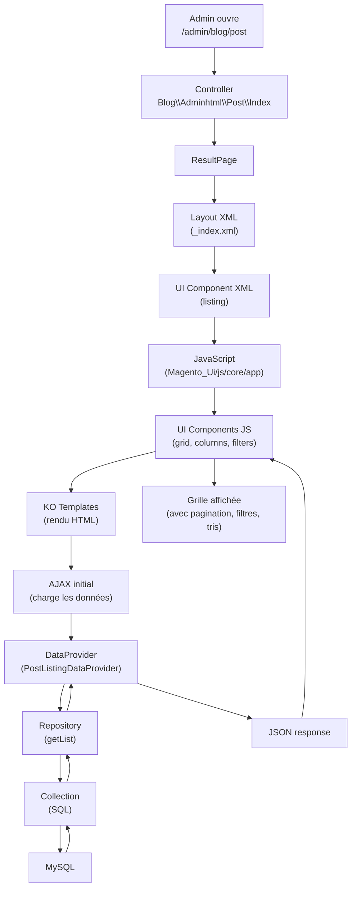

# Magento 2 — Composants et Interactions

> **Target audience**: débutants qui veulent comprendre **qui appelle qui**
> dans Magento 2. Ce guide montre le flux complet d'une requête, du navigateur
> jusqu'à la base de données, et comment les composants (Controller, Block,
> Template, Model, UI Component…) collaborent.

---

## 1. Vue d'ensemble des couches

```
┌─────────────────────────────────────────────────────────────┐
│                     NAVIGATEUR (client)                      │
│                   http://localhost:8080/blog                 │
└───────────────────────────┬─────────────────────────────────┘
                            │ HTTP Request
                            ▼
┌─────────────────────────────────────────────────────────────┐
│  NGINX (web server)                                          │
│  - sert les fichiers statiques (CSS, JS, images)             │
│  - transmet les requêtes dynamiques à PHP-FPM                │
└───────────────────────────┬─────────────────────────────────┘
                            │ fastcgi
                            ▼
┌─────────────────────────────────────────────────────────────┐
│  PHP-FPM 8.2                                                │
│  - exécute index.php (point d'entrée unique)                │
└───────────────────────────┬─────────────────────────────────┘
                            │ bootstrap
                            ▼
┌─────────────────────────────────────────────────────────────┐
│  MAGENTO FRONT CONTROLLER                                   │
│  - identifie l'area (frontend / adminhtml / webapi_rest)    │
│  - instancie le Router                                      │
└───────────────────────────┬─────────────────────────────────┘
                            │ match URL
                            ▼
┌─────────────────────────────────────────────────────────────┐
│  ROUTER                                                      │
│  - compare l'URL aux routes déclarées dans routes.xml       │
│  - trouve : module=Blog, controller=index, action=index     │
│  → classe : AlpineCommerce\Blog\Controller\Index\Index     │
└───────────────────────────┬─────────────────────────────────┘
                            │ dispatch
                            ▼
┌─────────────────────────────────────────────────────────────┐
│  CONTROLLER                                                   │
│  - orchestre la requête                                      │
│  - NE contient PAS de logique métier                         │
│  - appelle le Repository (Service Contract)                  │
│  - retourne un Result (page, JSON, redirect)                 │
└───────────────────────────┬─────────────────────────────────┘
                            │ result
                            ▼
┌─────────────────────────────────────────────────────────────┐
│  RESPONSE                                                    │
│  - HTML (page complète) / JSON (REST) / Redirect             │
└─────────────────────────────────────────────────────────────┘
```

---

## 2. Le flux complet d'une page Magento

### 2.1 Page frontend : `/blog`



**Étape par étape :**

| # | Composant | Rôle | Exemple AlpineCommerce |
|---|-----------|------|------------------------|
| 1 | **Nginx** | Reçoit la requête HTTP, sert les fichiers statiques | `localhost:8080` |
| 2 | **index.php** | Point d'entrée unique, bootstrappe Magento | `src/index.php` |
| 3 | **Front Controller** | Identifie l'area (`frontend`, `adminhtml`, `webapi_rest`) | `Framework/App/FrontControllerInterface` |
| 4 | **Router** | Matche l'URL à une classe Controller via `routes.xml` | `Blog/etc/frontend/routes.xml` |
| 5 | **Controller** | Orchestre, appelle les services, retourne un Result | `Blog/Controller/Index/Index.php` |
| 6 | **Repository** | Logique métier (save, getById, getList) | `Blog/Model/PostRepository.php` |
| 7 | **ResourceModel** | Exécute les requêtes SQL | `Blog/Model/ResourceModel/Post.php` |
| 8 | **Block** | Prépare les données pour le template | `Blog/Block/PostList.php` |
| 9 | **Template** | Affiche le HTML (`.phtml`) | `view/frontend/templates/post/list.phtml` |
| 10 | **Response** | Renvoie le HTML complet au navigateur | `Page/Result.php` |

### 2.2 Page admin : formulaire d'édition



**Différences avec le frontend :**
- L'**area** est `adminhtml` (pas `frontend`)
- Les formulaires admin utilisent des **UI Components** (`<form>` en XML) au lieu de Blocks + Templates classiques
- Un **DataProvider** alimente le formulaire en données (appelle le Repository)

---

## 3. Les composants Magento et leurs relations

### 3.1 Carte des responsabilités

```
┌──────────────────────────────────────────────────────────────┐
│                      NAVIGATEUR                               │
│            (affiche HTML, CSS, JS, images)                   │
└────────────────────────────┬─────────────────────────────────┘
                             │
              ┌──────────────┼──────────────┐
              ▼              ▼              ▼
        ┌──────────┐  ┌──────────┐  ┌──────────┐
        │  Nginx   │  │  Nginx   │  │  Nginx   │
        │ (:8080)  │  │ (:8080)  │  │ (:8080)  │
        └────┬─────┘  └────┬─────┘  └────┬─────┘
             │             │             │
             ▼             ▼             ▼
        ┌──────────────────────────────────────┐
        │          PHP-FPM (index.php)          │
        └──────────────────┬───────────────────┘
                           │
                           ▼
        ┌──────────────────────────────────────┐
        │      MAGENTO FRAMEWORK                │
        │  ┌────────────────────────────────┐  │
        │  │  Object Manager (DI Container) │  │
        │  │  - construit tous les objets  │  │
        │  │  - injecte les dépendances    │  │
        │  └──────────┬─────────────────────┘  │
        │             │                         │
        │  ┌──────────┴─────────────────────┐  │
        │  │                                 │  │
        │  ▼                                 ▼  │
        │ ┌─────────────┐          ┌──────────────┐
        │ │   Router     │          │  WebAPI      │
        │ │ (frontend,   │          │  (REST,      │
        │ │  adminhtml)  │          │   GraphQL)   │
        │ └──────┬──────┘          └──────────────┘
        │        │
        │        ▼
        │ ┌─────────────┐
        │ │  Controller  │
        │ │  (orchestre) │
        │ └──────┬──────┘
        │        │
        │        ▼
        │ ┌─────────────┐      ┌──────────────┐
        │ │  Repository  │◄────►│   Block /    │
        │ │  (métier)    │      │   UI DataProv│
        │ └──────┬──────┘      └──────┬───────┘
        │        │                    │
        │        ▼                    ▼
        │ ┌─────────────┐      ┌──────────────┐
        │ │ ResourceModel│      │  Template    │
        │ │  (SQL)       │      │  (.phtml)    │
        │ └──────┬──────┘      └──────┬───────┘
        │        │                    │
        │        ▼                    │
        │ ┌─────────────┐             │
        │ │    MySQL     │             │
        │ │  (données)   │             │
        │ └─────────────┘             │
        │                              │
        │        ┌─────────────────────┘
        │        ▼
        │ ┌─────────────┐
        │ │   Layout     │
        │ │  (structure) │
        │ └──────┬──────┘
        │        │
        │        ▼
        │ ┌─────────────┐
        │ │    HTML      │
        │ │  (Response)  │
        │ └─────────────┘
        │
        └──────────────────────────────────────┘
```

### 3.2 Qui appelle qui ? (tableau de référence)

| Composant | Appelle | Appelé par | Rôle |
|-----------|---------|------------|------|
| **Router** | Controller | Front Controller | Trouve le bon Controller selon l'URL |
| **Controller** | Repository, Block, ResultFactory | Router | Orchestre la requête |
| **Repository** | ResourceModel, autres Repositories | Controller, Block, DataProvider | Logique métier |
| **ResourceModel** | Connection (MySQL) | Repository | Requêtes SQL |
| **Block** | Repository, Helper, autres Blocks | Layout XML | Prépare les données pour l'affichage |
| **Template (.phtml)** | Block (via `$this`) | Block | Affiche le HTML |
| **UI DataProvider** | Repository | UI Component XML | Alimente les grilles/formulaires admin |
| **Layout XML** | Block | Controller (via Result) | Définit la structure de la page |
| **Plugin** | Méthode d'une classe cible | Automatique (DI) | Modifie le comportement d'une méthode |
| **Observer** | N'importe quel service | Event dispatché | Réagit à un événement métier |
| **Helper** | Autres services | Block, Template | Outils transversaux (config, logs) |
| **ResultFactory** | N/A | Controller | Crée la réponse (page, JSON, redirect) |
| **Object Manager** | Toutes les classes | Automatique | Crée les objets, injecte les dépendances |

---

## 4. Flux détaillé par type de page

### 4.1 Page CMS (ex: `/about-us`)

```
Navigateur
  → Nginx
    → index.php
      → Router (cms_page_view)
        → Controller (Cms/Page/View)
          → PageRepository (récupère la page en DB)
            → ResourceModel (SELECT FROM cms_page)
          → ResultPage (créé via ResultFactory)
            → Layout (cms_page_view.xml)
              → Block (page)
                → Template (page.phtml)
          → Response (HTML)
    → Navigateur
```

### 4.2 API REST (ex: `GET /rest/V1/blog/posts`)

```
Client REST
  → Nginx
    → index.php (area = webapi_rest)
      → WebAPI Router (lit webapi.xml)
        → Service Contract (PostRepositoryInterface)
          → Implementation (PostRepository)
            → ResourceModel (SELECT FROM blog_post)
              → MySQL
        → Response JSON
    → Client REST
```

**Différence clé** : pas de Controller, pas de Block, pas de Template.
Le WebAPI Router appelle directement le **Service Contract**.

### 4.3 Formulaire admin avec UI Component

```
Admin GET /admin/blog/post/edit/id/1
  → Nginx
    → index.php (area = adminhtml)
      → Router
        → Controller (Blog/Adminhtml/Post/Edit)
          → ResultPage
            → Layout (_edit.xml)
              → UI Component (blog_post_form)
                → DataProvider (PostFormDataProvider)
                  → Repository (PostRepository::getById)
                    → MySQL
                → Form fields (inputs générés par JS)
              → Block (container)
        → Response (HTML + JS qui initialise le formulaire)

Admin POST /admin/blog/post/save
  → Nginx
    → index.php (area = adminhtml)
      → Router
        → Controller (Blog/Adminhtml/Post/Save)
          → Repository (PostRepository::save)
            → ResourceModel (INSERT/UPDATE)
              → MySQL
          → ResultRedirect (vers la liste)
        → Response (redirect)
```

---

## 5. Les 3 types de requêtes Magento

| Type | Area | Entry point | Réponse | Exemple |
|------|------|-------------|---------|---------|
| **Page frontend** | `frontend` | Controller → Block → Template | HTML complet | `/blog`, `/catalog/product/view/id/1` |
| **Page admin** | `adminhtml` | Controller → UI Component → DataProvider | HTML + JS | `/admin/blog/post/edit` |
| **API REST** | `webapi_rest` | WebAPI Router → Service Contract | JSON | `/rest/V1/blog/posts` |
| **API SOAP** | `webapi_soap` | WebAPI Router → Service Contract | XML SOAP | `/soap/?wsdl` |
| **API GraphQL** | `graphql` | GraphQL Router → Resolver | JSON | `/graphql` |

---

## 6. Le système de Layout (structure des pages)

Le **Layout** est le squelette de la page. Il définit quels Blocks
apparaissent et où.

### 6.1 Exemple : page blog

```xml
<!-- view/frontend/layout/blog_index_index.xml -->
<page xmlns:xsi="..." layout="1column">
    <body>
        <referenceContainer name="content">
            <block class="AlpineCommerce\Blog\Block\PostList"
                   name="blog.post.list"
                   template="AlpineCommerce_Blog::post/list.phtml"
                   before="-"/>
        </referenceContainer>
    </body>
</page>
```

**Ce qui se passe :**
1. Le Controller retourne un `ResultPage`
2. Magento charge le layout XML correspondant à la route (`blog_index_index`)
3. Le layout XML ajoute un block `blog.post.list` dans le container `content`
4. Le block `PostList` appelle le Repository pour récupérer les posts
5. Le template `list.phtml` est rendu avec les données du block

### 6.2 Les conteneurs (containers)

Un **container** est un emplacement vide dans la page :

| Container | Contient | Défini dans |
|-----------|----------|-------------|
| `page.top` | Header | `Magento_Theme/layout/default.xml` |
| `content` | Contenu principal | `Magento_Theme/layout/default.xml` |
| `page.bottom` | Footer | `Magento_Theme/layout/default.xml` |
| `sidebar.main` | Sidebar gauche | `Magento_Theme/layout/default.xml` |
| `sidebar.additional` | Sidebar droite | `Magento_Theme/layout/default.xml` |

Les modules utilisent `<referenceContainer>` pour ajouter du contenu dans
ces emplacements sans réécrire le layout complet.

---

## 7. Les UI Components (admin)

Dans l'admin, Magento utilise des **UI Components** au lieu de Blocks +
Templates classiques. C'est un système XML → JavaScript → HTML.

### 7.1 Architecture d'un UI Component

```
XML (listing/form)
    ↓
JS (Magento_Ui/js/core/app interprète le XML)
    ↓
JS Components (grid, form, columns, filters)
    ↓
KO Templates (knockout.js : bindings, affichage conditionnel)
    ↓
HTML (généré par le navigateur)
    ↓
AJAX (appels au DataProvider pour les données)
```

### 7.2 Exemple : grille admin Blog

```xml
<!-- view/adminhtml/ui_component/alphacommerce_blog_post_listing.xml -->
<listing xmlns:xsi="..." xsi:noNamespaceSchemaLocation="...">
    <dataSource name="post_data_source">
        <argument name="dataProvider" xsi:type="configurableObject">
            <argument name="class" xsi:type="string">
                AlpineCommerce\Blog\Ui\DataProvider\PostListingDataProvider
            </argument>
            <argument name="name" xsi:type="string">post_data_source</argument>
            <argument name="primaryFieldName" xsi:type="string">entity_id</argument>
            <argument name="requestFieldName" xsi:type="string">id</argument>
        </argument>
    </dataSource>

    <columns name="post_columns">
        <column name="title">
            <settings>
                <label translate="true">Title</label>
                <sortOrder>10</sortOrder>
            </settings>
        </column>
        <column name="status">
            <settings>
                <label translate="true">Status</label>
                <sortOrder>20</sortOrder>
                <filter>select</filter>
            </settings>
        </column>
        <actions>
            <argument name="data" xsi:type="array">
                <item name="config" xsi:type="array">
                    <item name="urlPath" xsi:type="string">blog/post/edit</item>
                    <item name="paramName" xsi:type="string">id</item>
                </item>
            </argument>
        </actions>
    </columns>
</listing>
```

**Flux d'une UI Component :**



---

## 8. Les Design Patterns de Magento

### 8.1 Service Contract Pattern

```
Controller / REST / GraphQL
         │
         ▼
  Interface (Api/PostRepositoryInterface.php)
         │
         ▼
  Implementation (Model/PostRepository.php)
         │
         ▼
  ResourceModel (Model/ResourceModel/Post.php)
         │
         ▼
  Database
```

**Avantage** : tu peux changer l'implémentation sans toucher au Controller,
au REST API, ou au GraphQL.

### 8.2 Factory Pattern

```php
// Au lieu de new Post()
$post = $postFactory->create(); // PostFactory injectée par DI
$post->setTitle('Hello');
$post->save();
```

Les **Factories** créent des objets dynamiquement. Magento les génère
automatiquement via `di.xml` ou `codeGeneration`.

### 8.3 Proxy Pattern

Les **Proxies** retardent le chargement d'une dépendance jusqu'à son
utilisation effective. Déclaré dans `di.xml` :

```xml
<type name="AlpineCommerce\Blog\Model\PostRepository">
    <arguments>
        <argument name="logger" xsi:type="object">AlpineCommerce\Blog\Model\Logger\Proxy</argument>
    </arguments>
</type>
```

### 8.4 Repository Pattern

Le Repository est la **seule porte d'entrée** pour accéder aux données :

```php
interface PostRepositoryInterface
{
    public function save(PostInterface $post): PostInterface;
    public function getById(int $id): PostInterface;
    public function getList(SearchCriteriaInterface $criteria): SearchResultsInterface;
    public function delete(PostInterface $post): bool;
}
```

Jamais de `$connection->fetchRow()` dans un Controller ou un Block.

### 8.5 Data Patch Pattern

```php
class CreateDefaultCategory implements DataPatchInterface
{
    public function apply(): void { /* insert data */ }
    public static function getDependencies(): array { return []; }
    public function getAliases(): array { return []; }
}
```

Les Data Patches sont des classes PHP versionnées qui modifient les données
(ou le schéma) lors de `bin/magento setup:upgrade`.

---

## 9. Le cycle de vie d'une requête (résumé visuel)

```
┌──────────┐     ┌──────────┐     ┌──────────┐     ┌──────────┐
│ Browser  │────▶│  Nginx   │────▶│ index.php│────▶│   Area   │
│ (URL)    │     │          │     │          │     │Detection │
└──────────┘     └──────────┘     └──────────┘     └────┬─────┘
                                                       │
                    ┌──────────────────────────────────┼──────────┐
                    ▼                                  ▼          ▼
             ┌─────────────┐                  ┌─────────────┐ ┌──────────┐
             │   frontend   │                  │ adminhtml   │ │webapi_rest│
             └──────┬──────┘                  └──────┬──────┘ └────┬─────┘
                    ▼                               ▼             ▼
             ┌─────────────┐                  ┌─────────────┐ ┌──────────┐
             │   Router     │                  │   Router     │ │WebAPI    │
             └──────┬──────┘                  └──────┬──────┘ │Router    │
                    ▼                               ▼         └────┬─────┘
             ┌─────────────┐                  ┌─────────────┐        │
             │  Controller  │                  │  Controller  │       ▼
             └──────┬──────┘                  └──────┬──────┘ ┌──────────┐
                    ▼                               ▼         │ Service  │
             ┌─────────────┐                  ┌─────────────┐ │Contract  │
             │ Block/Template│                 │ UI Component │ └────┬─────┘
             └──────┬──────┘                  └──────┬──────┘      │
                    ▼                               ▼            ▼
             ┌─────────────┐                  ┌─────────────┐ ┌──────────┐
             │ Repository   │                  │ DataProvider │ │Repository│
             └──────┬──────┘                  └──────┬──────┘ └────┬─────┘
                    ▼                               ▼            ▼
             ┌─────────────┐                  ┌─────────────┐ ┌──────────┐
             │ ResourceModel │                 │ Repository   │ │ResourceModel│
             └──────┬──────┘                  └──────┬──────┘ └────┬─────┘
                    ▼                               ▼            ▼
             ┌─────────────┐                  ┌─────────────┐ ┌──────────┐
             │    MySQL      │                  │    MySQL     │ │   MySQL  │
             └──────────────┘                  └──────────────┘ └──────────┘
```

---

## 10. Tableau de correspondance AlpineCommerce

| Couche | Fichier exemple | Rôle dans le projet |
|--------|----------------|---------------------|
| **Router** | `Blog/etc/frontend/routes.xml` | Associe `/blog` au Controller `Blog\Index\Index` |
| **Controller** | `Blog/Controller/Index/Index.php` | Récupère les posts, retourne une page |
| **Repository** | `Blog/Model/PostRepository.php` | `getList()`, `save()`, `getById()` |
| **ResourceModel** | `Blog/Model/ResourceModel/Post.php` | Requêtes SQL |
| **Block** | `Blog/Block/PostList.php` | `getPosts()` pour le template |
| **Template** | `Blog/view/frontend/templates/post/list.phtml` | Affiche les posts en HTML |
| **Layout** | `Blog/view/frontend/layout/blog_index_index.xml` | Place le block dans `content` |
| **UI DataProvider** | `Blog/Ui/DataProvider/PostFormDataProvider.php` | Alimente le formulaire admin |
| **UI Component** | `Blog/view/adminhtml/ui_component/blog_post_form.xml` | Définit le formulaire admin |
| **Plugin** | `StorePickup/Plugin/Shipping/FilterFlatRate.php` | Cache Flat Rate si subtotal ≥ 50 |
| **Observer** | `StoreSetup/Observer/OrderPlacedAfter.php` | Log après chaque commande |
| **Helper** | `StoreSetup/Helper/Data.php` | Accès config + store manager |
| **Service Contract** | `Blog/Api/PostRepositoryInterface.php` | Interface publique du Repository |

---

## 11. Résumé mental pour les débutants

| Question | Réponse |
|----------|---------|
| **Où commence une requête ?** | `index.php` → Front Controller → Router |
| **Qui choisit quel Controller ?** | Le `Router` lit `routes.xml` |
| **Que fait le Controller ?** | Il orchestre : appelle les services, retourne un Result |
| **Où va la logique métier ?** | Dans le **Repository** (jamais dans le Controller) |
| **Comment accéder à la DB ?** | Repository → ResourceModel → MySQL |
| **Comment afficher du HTML ?** | Controller → Block → Template (.phtml) |
| **Comment fonctionne l'admin ?** | Controller → UI Component → DataProvider → Repository |
| **Comment ajouter du comportement sans modifier le core ?** | **Plugin** (intercepte une méthode) ou **Observer** (réagit à un event) |
| **Comment échanger des données avec l'extérieur ?** | **REST API** ou **GraphQL** (appellent directement les Service Contracts) |
| **Qui construit tous les objets ?** | L'**Object Manager** (DI Container) automatiquement |

---

## 12. Analogie du restaurant

Pour retenir les interactions :

| Rôle | Composant Magento | Analogie |
|------|-------------------|----------|
| Client qui commande | **Navigateur** | Le client qui entre au restaurant |
| Maître d'hôtel | **Router** | Accueille, regarde la réservation, dirige vers la bonne table |
| Serveur | **Controller** | Prend la commande, la transmet en cuisine |
| Cuisinier | **Repository** | Prépare le plat (logique métier) |
| Garde-manger | **ResourceModel** | Cherche les ingrédients (données) |
| Caisse / frigo | **MySQL** | Stocke les ingrédients |
| Plat servi | **Response** | Le plat arrive sur la table |
| Décorateur | **Layout / UI Component** | Dispose les couverts, l'assiette, la déco |
| Plat écrit sur papier | **Template (.phtml)** | Le contenu visible du plat |

---

*Last updated: 2026-08-11.*
