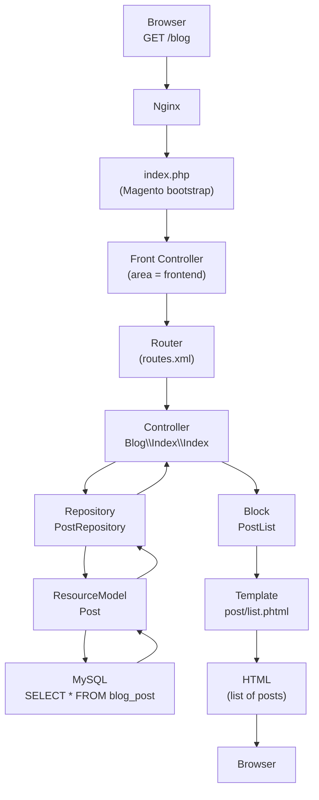
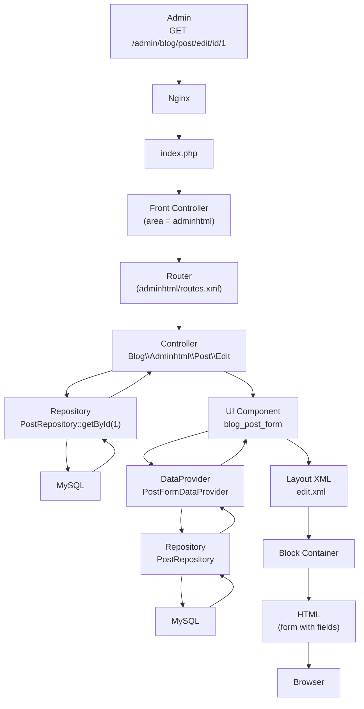
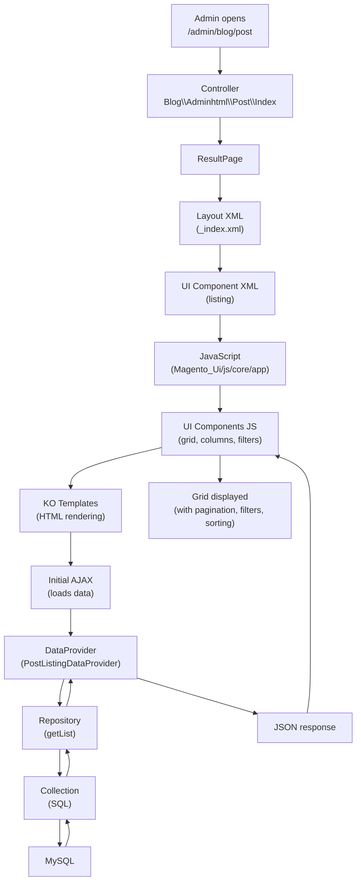

# Magento 2 — Components and Interactions

> **Target audience**: beginners who want to understand **who calls who**
> in Magento 2. This guide shows the complete flow of a request, from the browser
> to the database, and how the components (Controller, Block,
> Template, Model, UI Component…) collaborate.

---

## 1. Layer overview

```
┌─────────────────────────────────────────────────────────────┐
│                     BROWSER (client)                        │
│                   http://localhost:8080/blog                 │
└───────────────────────────┬─────────────────────────────────┘
                             │ HTTP Request
                             ▼
┌─────────────────────────────────────────────────────────────┐
│  NGINX (web server)                                          │
│  - serves static files (CSS, JS, images)                     │
│  - forwards dynamic requests to PHP-FPM                      │
└───────────────────────────┬─────────────────────────────────┘
                             │ fastcgi
                             ▼
┌─────────────────────────────────────────────────────────────┐
│  PHP-FPM 8.2                                                │
│  - executes index.php (single entry point)                   │
└───────────────────────────┬─────────────────────────────────┘
                             │ bootstrap
                             ▼
┌─────────────────────────────────────────────────────────────┐
│  MAGENTO FRONT CONTROLLER                                   │
│  - identifies the area (frontend / adminhtml / webapi_rest)  │
│  - instantiates the Router                                   │
└───────────────────────────┬─────────────────────────────────┘
                             │ match URL
                             ▼
┌─────────────────────────────────────────────────────────────┐
│  ROUTER                                                      │
│  - compares the URL to routes declared in routes.xml          │
│  - finds: module=Blog, controller=index, action=index        │
│  → class: AlpineCommerce\Blog\Controller\Index\Index         │
└───────────────────────────┬─────────────────────────────────┘
                             │ dispatch
                             ▼
┌─────────────────────────────────────────────────────────────┐
│  CONTROLLER                                                   │
│  - orchestrates the request                                   │
│  - does NOT contain business logic                            │
│  - calls the Repository (Service Contract)                    │
│  - returns a Result (page, JSON, redirect)                    │
└───────────────────────────┬─────────────────────────────────┘
                             │ result
                             ▼
┌─────────────────────────────────────────────────────────────┐
│  RESPONSE                                                     │
│  - HTML (full page) / JSON (REST) / Redirect                   │
└─────────────────────────────────────────────────────────────┘
```

---

## 2. The complete flow of a Magento page

### 2.1 Frontend page: `/blog`



**Step by step:**

| # | Component | Role | AlpineCommerce example |
|---|-----------|------|------------------------|
| 1 | **Nginx** | Receives the HTTP request, serves static files | `localhost:8080` |
| 2 | **index.php** | Single entry point, bootstraps Magento | `src/index.php` |
| 3 | **Front Controller** | Identifies the area (`frontend`, `adminhtml`, `webapi_rest`) | `Framework/App/FrontControllerInterface` |
| 4 | **Router** | Matches the URL to a Controller class via `routes.xml` | `Blog/etc/frontend/routes.xml` |
| 5 | **Controller** | Orchestrates, calls services, returns a Result | `Blog/Controller/Index/Index.php` |
| 6 | **Repository** | Business logic (save, getById, getList) | `Blog/Model/PostRepository.php` |
| 7 | **ResourceModel** | Executes SQL queries | `Blog/Model/ResourceModel/Post.php` |
| 8 | **Block** | Prepares data for the template | `Blog/Block/PostList.php` |
| 9 | **Template** | Displays HTML (`.phtml`) | `view/frontend/templates/post/list.phtml` |
| 10 | **Response** | Returns the complete HTML to the browser | `Page/Result.php` |

### 2.2 Admin page: edit form



**Differences with the frontend:**
- The **area** is `adminhtml` (not `frontend`)
- Admin forms use **UI Components** (`<form>` in XML) instead of classic Blocks + Templates
- A **DataProvider** feeds the form with data (calls the Repository)

---

## 3. Magento components and their relationships

### 3.1 Responsibility map

```
┌──────────────────────────────────────────────────────────────┐
│                      BROWSER                                   │
│            (displays HTML, CSS, JS, images)                   │
└────────────────────────────┬─────────────────────────────────┘
                              │
               ┌──────────────┼──────────────┐
               ▼              ▼              ▼
         ┌──────────┐  ┌──────────┐  ┌──────────┐
         │  Nginx   │  │  Nginx   │  │  Nginx   │
         │ (:8080)  │  │ (:8080)  │  │ (:8080)  │
         └────┬─────┘  └────┬─────┘  └────┬─────┘
              │             │             │
              ▼             ▼             ▼
         ┌──────────────────────────────────────┐
         │          PHP-FPM (index.php)          │
         └──────────────────┬───────────────────┘
                            │
                            ▼
         ┌──────────────────────────────────────┐
         │      MAGENTO FRAMEWORK                │
         │  ┌────────────────────────────────┐  │
         │  │  Object Manager (DI Container) │  │
         │  │  - builds all objects          │  │
         │  │  - injects dependencies        │  │
         │  └──────────┬─────────────────────┘  │
         │             │                         │
         │  ┌──────────┴─────────────────────┐  │
         │  │                                 │  │
         │  ▼                                 ▼  │
         │ ┌─────────────┐          ┌──────────────┐
         │ │   Router     │          │  WebAPI      │
         │ │ (frontend,   │          │  (REST,      │
         │ │  adminhtml)  │          │   GraphQL)   │
         │ └──────┬──────┘          └──────────────┘
         │        │
         │        ▼
         │ ┌─────────────┐
         │ │  Controller  │
         │ │  (orchestrates) │
         │ └──────┬──────┘
         │        │
         │        ▼
         │ ┌─────────────┐      ┌──────────────┐
         │ │  Repository  │◄────►│   Block /    │
         │ │  (business)  │      │   UI DataProv│
         │ └──────┬──────┘      └──────┬───────┘
         │        │                    │
         │        ▼                    ▼
         │ ┌─────────────┐      ┌──────────────┐
         │ │ ResourceModel│      │  Template    │
         │ │  (SQL)       │      │  (.phtml)    │
         │ └──────┬──────┘      └──────┬───────┘
         │        │                    │
         │        ▼                    │
         │ ┌─────────────┐             │
         │ │    MySQL     │             │
         │ │  (data)      │             │
         │ └─────────────┘             │
         │                              │
         │        ┌─────────────────────┘
         │        ▼
         │ ┌─────────────┐
         │ │   Layout     │
         │ │  (structure) │
         │ └──────┬──────┘
         │        │
         │        ▼
         │ ┌─────────────┐
         │ │    HTML      │
         │ │  (Response)  │
         │ └─────────────┘
         │
         └──────────────────────────────────────┘
```

### 3.2 Who calls who? (reference table)

| Component | Calls | Called by | Role |
|-----------|-------|-----------|------|
| **Router** | Controller | Front Controller | Finds the right Controller based on the URL |
| **Controller** | Repository, Block, ResultFactory | Router | Orchestrates the request |
| **Repository** | ResourceModel, other Repositories | Controller, Block, DataProvider | Business logic |
| **ResourceModel** | Connection (MySQL) | Repository | SQL queries |
| **Block** | Repository, Helper, other Blocks | Layout XML | Prepares data for display |
| **Template (.phtml)** | Block (via `$this`) | Block | Displays HTML |
| **UI DataProvider** | Repository | UI Component XML | Feeds admin grids/forms |
| **Layout XML** | Block | Controller (via Result) | Defines page structure |
| **Plugin** | Method of a target class | Automatic (DI) | Modifies method behavior |
| **Observer** | Any service | Dispatched Event | Reacts to a business event |
| **Helper** | Other services | Block, Template | Cross-cutting tools (config, logs) |
| **ResultFactory** | N/A | Controller | Creates the response (page, JSON, redirect) |
| **Object Manager** | All classes | Automatic | Creates objects, injects dependencies |

---

## 4. Detailed flow by page type

### 4.1 CMS page (e.g. `/about-us`)

```
Browser
  → Nginx
    → index.php
      → Router (cms_page_view)
        → Controller (Cms/Page/View)
          → PageRepository (retrieves the page from DB)
            → ResourceModel (SELECT FROM cms_page)
          → ResultPage (created via ResultFactory)
            → Layout (cms_page_view.xml)
              → Block (page)
                → Template (page.phtml)
          → Response (HTML)
    → Browser
```

### 4.2 REST API (e.g. `GET /rest/V1/blog/posts`)

```
REST Client
  → Nginx
    → index.php (area = webapi_rest)
      → WebAPI Router (reads webapi.xml)
        → Service Contract (PostRepositoryInterface)
          → Implementation (PostRepository)
            → ResourceModel (SELECT FROM blog_post)
              → MySQL
        → JSON Response
    → REST Client
```

**Key difference**: no Controller, no Block, no Template.
The WebAPI Router calls the **Service Contract** directly.

### 4.3 Admin form with UI Component

```
Admin GET /admin/blog/post/edit/id/1
  → Nginx
    → index.php (area = adminhtml)
      → Router
        → Controller (Blog/Adminhtml/Post/Edit)
          → ResultPage
            → Layout (_edit.xml)
              → UI Component (blog_post_form)
                → DataProvider (PostFormDataProvider)
                  → Repository (PostRepository::getById)
                    → MySQL
                → Form fields (inputs generated by JS)
              → Block (container)
          → Response (HTML + JS that initializes the form)

Admin POST /admin/blog/post/save
  → Nginx
    → index.php (area = adminhtml)
      → Router
        → Controller (Blog/Adminhtml/Post/Save)
          → Repository (PostRepository::save)
            → ResourceModel (INSERT/UPDATE)
              → MySQL
          → ResultRedirect (to the list)
          → Response (redirect)
```

---

## 5. The 3 types of Magento requests

| Type | Area | Entry point | Response | Example |
|------|------|-------------|----------|---------|
| **Frontend page** | `frontend` | Controller → Block → Template | Full HTML | `/blog`, `/catalog/product/view/id/1` |
| **Admin page** | `adminhtml` | Controller → UI Component → DataProvider | HTML + JS | `/admin/blog/post/edit` |
| **REST API** | `webapi_rest` | WebAPI Router → Service Contract | JSON | `/rest/V1/blog/posts` |
| **SOAP API** | `webapi_soap` | WebAPI Router → Service Contract | SOAP XML | `/soap/?wsdl` |
| **GraphQL API** | `graphql` | GraphQL Router → Resolver | JSON | `/graphql` |

---

## 6. The Layout system (page structure)

The **Layout** is the page skeleton. It defines which Blocks
appear and where.

### 6.1 Example: blog page

```xml
<!-- view/frontend/layout/blog_index_index.xml -->
<page xmlns:xsi="..." layout="1column">
    <body>
        <referenceContainer name="content">
            <block class="AlpineCommerce\Blog\Block\PostList"
                   name="blog.post.list"
                   template="AlpineCommerce_Blog::post/list.phtml"
                   before="-"/>
        </referenceContainer>
    </body>
</page>
```

**What happens:**
1. The Controller returns a `ResultPage`
2. Magento loads the layout XML corresponding to the route (`blog_index_index`)
3. The layout XML adds a block `blog.post.list` in the `content` container
4. The `PostList` block calls the Repository to retrieve the posts
5. The template `list.phtml` is rendered with the block's data

### 6.2 Containers

A **container** is an empty location in the page:

| Container | Contains | Defined in |
|-----------|----------|------------|
| `page.top` | Header | `Magento_Theme/layout/default.xml` |
| `content` | Main content | `Magento_Theme/layout/default.xml` |
| `page.bottom` | Footer | `Magento_Theme/layout/default.xml` |
| `sidebar.main` | Left sidebar (filters, categories) | `Magento_Theme/layout/default.xml` |
| `sidebar.additional` | Right sidebar (widgets) | `Magento_Theme/layout/default.xml` |

Modules use `<referenceContainer>` to add content in
these locations without rewriting the complete layout.

---

## 7. UI Components (admin)

In the admin, Magento uses **UI Components** instead of classic Blocks +
Templates. It is an XML → JavaScript → HTML system.

### 7.1 UI Component architecture

```
XML (listing/form)
    ↓
JS (Magento_Ui/js/core/app interprets the XML)
    ↓
JS Components (grid, form, columns, filters)
    ↓
KO Templates (knockout.js: bindings, conditional display)
    ↓
HTML (generated by the browser)
    ↓
AJAX (calls to the DataProvider for data)
```

### 7.2 Example: Blog admin grid

```xml
<!-- view/adminhtml/ui_component/alphacommerce_blog_post_listing.xml -->
<listing xmlns:xsi="..." xsi:noNamespaceSchemaLocation="...">
    <dataSource name="post_data_source">
        <argument name="dataProvider" xsi:type="configurableObject">
            <argument name="class" xsi:type="string">
                AlpineCommerce\Blog\Ui\DataProvider\PostListingDataProvider
            </argument>
            <argument name="name" xsi:type="string">post_data_source</argument>
            <argument name="primaryFieldName" xsi:type="string">entity_id</argument>
            <argument name="requestFieldName" xsi:type="string">id</argument>
        </argument>
    </dataSource>

    <columns name="post_columns">
        <column name="title">
            <settings>
                <label translate="true">Title</label>
                <sortOrder>10</sortOrder>
            </settings>
        </column>
        <column name="status">
            <settings>
                <label translate="true">Status</label>
                <sortOrder>20</sortOrder>
                <filter>select</filter>
            </settings>
        </column>
        <actions>
            <argument name="data" xsi:type="array">
                <item name="config" xsi:type="array">
                    <item name="urlPath" xsi:type="string">blog/post/edit</item>
                    <item name="paramName" xsi:type="string">id</item>
                </item>
            </argument>
        </actions>
    </columns>
</listing>
```

**UI Component flow:**



---

## 8. Magento Design Patterns

### 8.1 Service Contract Pattern

```
Controller / REST / GraphQL
         │
         ▼
   Interface (Api/PostRepositoryInterface.php)
         │
         ▼
   Implementation (Model/PostRepository.php)
         │
         ▼
   ResourceModel (Model/ResourceModel/Post.php)
         │
         ▼
   Database
```

**Advantage**: you can change the implementation without touching the Controller,
the REST API, or GraphQL.

### 8.2 Factory Pattern

```php
// Instead of new Post()
$post = $postFactory->create(); // PostFactory injected by DI
$post->setTitle('Hello');
$post->save();
```

**Factories** create objects dynamically. Magento generates
them automatically via `di.xml` or `codeGeneration`.

### 8.3 Proxy Pattern

**Proxies** defer loading a dependency until it is actually used. Declared in `di.xml`:

```xml
<type name="AlpineCommerce\Blog\Model\PostRepository">
    <arguments>
        <argument name="logger" xsi:type="object">AlpineCommerce\Blog\Model\Logger\Proxy</argument>
    </arguments>
</type>
```

### 8.4 Repository Pattern

The Repository is the **only entry point** for accessing data:

```php
interface PostRepositoryInterface
{
    public function save(PostInterface $post): PostInterface;
    public function getById(int $id): PostInterface;
    public function getList(SearchCriteriaInterface $criteria): SearchResultsInterface;
    public function delete(PostInterface $post): bool;
}
```

Never use `$connection->fetchRow()` in a Controller or Block.

### 8.5 Data Patch Pattern

```php
class CreateDefaultCategory implements DataPatchInterface
{
    public function apply(): void { /* insert data */ }
    public static function getDependencies(): array { return []; }
    public function getAliases(): array { return []; }
}
```

Data Patches are versioned PHP classes that modify data
(or schema) during `bin/magento setup:upgrade`.

---

## 9. The request lifecycle (visual summary)

```
┌──────────┐     ┌──────────┐     ┌──────────┐     ┌──────────┐
│ Browser  │────▶│  Nginx   │────▶│ index.php│────▶│   Area   │
│ (URL)    │     │          │     │          │     │Detection │
└──────────┘     └──────────┘     └──────────┘     └────┬─────┘
                                                        │
                     ┌──────────────────────────────────┼──────────┐
                     ▼                                  ▼          ▼
              ┌─────────────┐                  ┌─────────────┐ ┌──────────┐
              │   frontend   │                  │ adminhtml   │ │webapi_rest│
              └──────┬──────┘                  └──────┬──────┘ └────┬─────┘
                     ▼                               ▼             ▼
              ┌─────────────┐                  ┌─────────────┐ ┌──────────┐
              │   Router     │                  │   Router     │ │WebAPI    │
              └──────┬──────┘                  └──────┬──────┘ │Router    │
                     ▼                               ▼         └────┬─────┘
              ┌─────────────┐                  ┌─────────────┐        │
              │  Controller  │                  │  Controller  │       ▼
              └──────┬──────┘                  └──────┬──────┘ ┌──────────┐
                     ▼                               ▼         │ Service  │
              ┌─────────────┐                  ┌─────────────┐ │Contract  │
              │ Block/Template│                 │ UI Component │ └────┬─────┘
              └──────┬──────┘                  └──────┬──────┘      │
                     ▼                               ▼            ▼
              ┌─────────────┐                  ┌─────────────┐ ┌──────────┐
              │ Repository   │                  │ DataProvider │ │Repository│
              └──────┬──────┘                  └──────┬──────┘ └────┬─────┘
                     ▼                               ▼            ▼
              ┌─────────────┐                  ┌─────────────┐ ┌──────────┐
              │ ResourceModel │                 │ Repository   │ │ResourceModel│
              └──────┬──────┘                  └──────┬──────┘ └────┬─────┘
                     ▼                               ▼            ▼
              ┌─────────────┐                  ┌─────────────┐ ┌──────────┐
              │    MySQL      │                  │    MySQL     │ │   MySQL  │
              └──────────────┘                  └──────────────┘ └──────────┘
```

---

## 10. AlpineCommerce mapping table

| Layer | Example file | Role in the project |
|-------|--------------|---------------------|
| **Router** | `Blog/etc/frontend/routes.xml` | Maps `/blog` to Controller `Blog\Index\Index` |
| **Controller** | `Blog/Controller/Index/Index.php` | Retrieves posts, returns a page |
| **Repository** | `Blog/Model/PostRepository.php` | `getList()`, `save()`, `getById()` |
| **ResourceModel** | `Blog/Model/ResourceModel/Post.php` | SQL queries |
| **Block** | `Blog/Block/PostList.php` | `getPosts()` for the template |
| **Template** | `Blog/view/frontend/templates/post/list.phtml` | Displays posts in HTML |
| **Layout** | `Blog/view/frontend/layout/blog_index_index.xml` | Places the block in `content` |
| **UI DataProvider** | `Blog/Ui/DataProvider/PostFormDataProvider.php` | Feeds the admin form |
| **UI Component** | `Blog/view/adminhtml/ui_component/blog_post_form.xml` | Defines the admin form |
| **Plugin** | `StorePickup/Plugin/Shipping/FilterFlatRate.php` | Caches Flat Rate if subtotal ≥ 50 |
| **Observer** | `StoreSetup/Observer/OrderPlacedAfter.php` | Logs after each order |
| **Helper** | `StoreSetup/Helper/Data.php` | Config access + store manager |
| **Service Contract** | `Blog/Api/PostRepositoryInterface.php` | Public Repository interface |

---

## 11. Mental summary for beginners

| Question | Answer |
|----------|--------|
| **Where does a request start?** | `index.php` → Front Controller → Router |
| **Who chooses which Controller?** | The `Router` reads `routes.xml` |
| **What does the Controller do?** | It orchestrates: calls services, returns a Result |
| **Where does business logic go?** | In the **Repository** (never in the Controller) |
| **How to access the DB?** | Repository → ResourceModel → MySQL |
| **How to display HTML?** | Controller → Block → Template (.phtml) |
| **How does the admin work?** | Controller → UI Component → DataProvider → Repository |
| **How to add behavior without modifying core?** | **Plugin** (intercepts a method) or **Observer** (reacts to an event) |
| **How to exchange data with the outside?** | **REST API** or **GraphQL** (call Service Contracts directly) |
| **Who builds all the objects?** | The **Object Manager** (DI Container) automatically |

---

## 12. Restaurant analogy

To remember the interactions:

| Role | Magento Component | Analogy |
|------|-------------------|---------|
| Customer who orders | **Browser** | The customer entering the restaurant |
| Maître d'hôtel | **Router** | Welcomes, checks the reservation, directs to the right table |
| Server | **Controller** | Takes the order, sends it to the kitchen |
| Cook | **Repository** | Prepares the dish (business logic) |
| Pantry | **ResourceModel** | Looks for ingredients (data) |
| Cash register / fridge | **MySQL** | Stores ingredients |
| Served dish | **Response** | The dish arrives at the table |
| Decorator | **Layout / UI Component** | Arranges cutlery, plate, decor |
| Dish written on paper | **Template (.phtml)** | The visible content of the dish |

---

*Last updated: 2026-08-11.*
